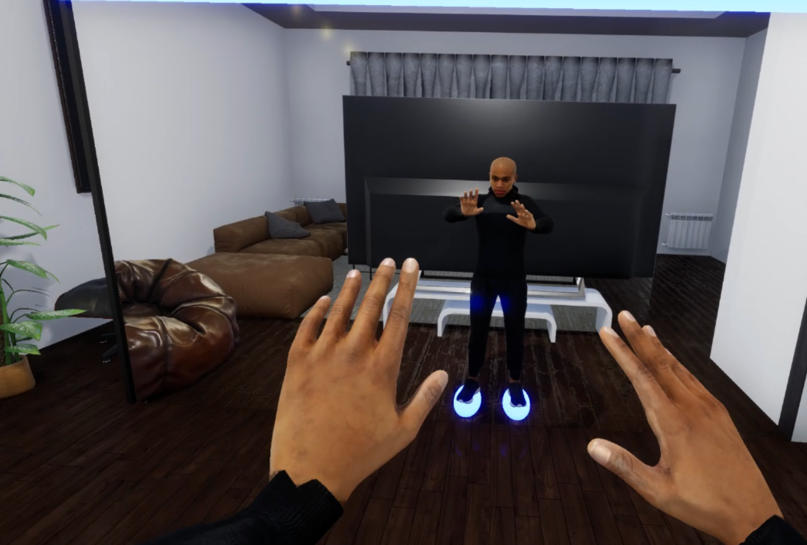

# The Pit Room

## Description
This project was developed during my time as a Research Assistant in the Ubiquitous Computing (UBICOMP) research group at the University of Oulu, where it was later used as my Masters Thesis project in Computer Science and Engineering.
You can find the full details of this project in my Thesis: http://urn.fi/URN:NBN:fi:oulu-202306302811

## Tools used
- Unreal Engine (5.0.2)
- C++
- SteamVR
- Meta Quest 2 HMD + Controllers (*for initial development stages*)
- Valve Index HMD + Controllers
- Vive Trackers 2.0

## Assets
These are the asset packs that were used in this project, along with the default StarterContent and VR Template packages from Unreal Engine 5.0.2:
- [Construction Site VOL. 1 - Supply and Material Props](https://www.unrealengine.com/marketplace/en-US/product/construction-site-vol-1-supply-and-material-props) by Dekogon Studios [FREE]
- [Construction Site VOL. 2 - Tools, Parts, and Machine Props](https://www.unrealengine.com/marketplace/en-US/product/construction-site-vol-2-tools-parts-and-machine-props) by Dekogon Studios [FREE]
- [Free Furniture Pack](https://www.unrealengine.com/marketplace/en-US/product/a4907129f69c44a892f76782489736ab) by Next Level 3D [FREE]
- [Twinmotion Chairs & Tables Pack 1](https://www.unrealengine.com/marketplace/en-US/product/twinmotion-chairs-tables-pack-1) by Epic Games [FREE]
- [Big Office](https://www.unrealengine.com/marketplace/en-US/item/1148cd2554e347209966bb78b2278677) by 1D.STUDIO [Paid]
- [Vive Mocap Kit](https://www.unrealengine.com/marketplace/en-US/item/c5714954833e45629e233185a216b21c) by Yuri N Kalinin [Paid]

## Demo
